# Strata

[](https://github.com/boyzwhocried/strata/actions/workflows/ci.yml)
[](https://boyzwhocried.github.io/strata/)

A small, runnable insurance data platform. It generates a synthetic insurance
book, lands it as monthly source batches, then transforms it through a
bronze / silver / gold medallion architecture with DuckDB and dbt: slowly
changing dimensions, deduplication, data contracts, tests, and a reconciliation
report.

Strata is named for its layers. The interesting part is not that data moves from
raw to clean. It is that the raw data is deliberately messy in the ways real
source systems are messy (late-arriving facts, idempotent re-sends, drifting
attributes, dirty categoricals), and every layer has a stated job in resolving
that mess. The whole thing runs on a laptop with one command and no cloud
account.

```
make up
```

That generates the data, builds every model, runs 42 tests, and prints the
reports below.

Prefer not to run anything? Explore the **live lineage graph**, rebuilt from CI
on every push: https://boyzwhocried.github.io/strata/ . It is the full bronze to
gold DAG with every model, test, and contract, clickable down to the column.

## Why this exists

Most data-engineering demos pipe a clean CSV into a chart. Production data
engineering is the opposite: the schema is fine, the data is not. Strata models
the hard parts on purpose so the handling of them is visible in code:

| Injected on purpose | Looks like | Resolved by |
|---|---|---|
| Late-arriving facts | a claim dated March lands in the May batch | batch ingest in bronze, `is_late_arrival` flag, as-of joins |
| Idempotent re-sends | the same payment row arrives twice, sometimes in a later batch | silver dedup, keep latest by ingest |
| Slowly changing attributes | a customer's risk class and income band change over time | `silver_dim_customer` Type-2 SCD with valid_from / valid_to |
| Dirty categoricals | `ACTIVE`, `active`, `  Active ` for one status | normalize before anything else compares values |
| Bad values and nulls | unpaid premiums, the occasional negative amount | quality flags plus tests that count them |
| Out-of-order timestamps | a premium paid before its due date | `is_paid_before_due` flag |

## Architecture

```mermaid
flowchart LR
    GEN["generate/<br/>seeded synthetic source"] --> RAW

    subgraph RAW["raw (parquet, monthly batches)"]
        direction TB
        RAWN["customer_snapshots · policies<br/>premium_payments · claims · agents"]
    end

    RAW --> BRONZE

    subgraph BRONZE["bronze (views, 1:1, mess intact)"]
        direction TB
        BRN["bronze_*"]
    end

    BRONZE --> SILVER

    subgraph SILVER["silver (tables, conformed)"]
        direction TB
        SDC["silver_dim_customer<br/>(Type-2 SCD)"]
        SPP["silver_premium_payments<br/>(dedup + flags)"]
        SCL["silver_claims (dedup)"]
        SPO["silver_policies"]
        SAG["silver_agents"]
    end

    SILVER --> GOLD

    subgraph GOLD["gold (marts + reports)"]
        direction TB
        FPP["fct_premium_payments"]
        FCL["fct_claims"]
        PPF["policy_performance"]
        REC["rpt_reconciliation"]
        DQ["rpt_data_quality"]
    end
```



- **Bronze** reads the raw parquet in place (dbt-duckdb external sources). Views,
  one to one with source, nothing cleaned. Every messy value survives here.
- **Silver** is conformed and typed: categoricals normalized, facts deduped,
  the customer dimension turned into SCD2 history. Two models carry an enforced
  dbt **contract** (column set and types are a guarantee, not a hope).
- **Gold** is business-facing: enriched fact marts, a per-policy performance
  model with a loss ratio, plus two reports: a pipeline reconciliation and a
  data-quality scorecard.

See [docs/architecture.md](docs/architecture.md) for the SCD2 algorithm, the
late-arrival model, and the dedup strategy in detail.

## Quickstart

Requires Python 3.10+ . No database server, no cloud.

```bash
python -m venv .venv && . .venv/bin/activate   # Windows: .venv\Scripts\Activate.ps1
make install                                   # or: ./strata.ps1 install
make up                                         # or: ./strata.ps1 up
```

`make up` runs four steps: generate, dbt deps, dbt build, report. Everything is
deterministic: the same `--seed` reproduces byte-identical raw data, so the
pipeline is idempotent from the very first step.

Individual targets: `gen`, `deps`, `build`, `test`, `report`, `docs`, `clean`.

## What it produces

Pipeline reconciliation, proving bronze to silver integrity per fact stream
(`duplicates_removed` is exactly the idempotent re-sends collapsed by silver,
which can only ever remove rows, never invent them):

```
stream             bronze_rows   silver_rows   duplicates_removed   late_arrival_rows
premium_payments        18226         17957                  269                7215
claims                    404           397                    7                 278
```

Data-quality scorecard, counting how much of the injected mess the pipeline
surfaced or resolved:

```
metric                      value
payments_total              17957
payments_unpaid              3064
payments_invalid_amount       166
payments_paid_before_due     1943
payments_late_arrival        7215
claims_total                  397
claims_late_arrival           278
customers_scd_rows           3102     (2000 customers, 856 with real history)
customers_current            2000
customers_with_history        856
```

A single customer's SCD2 history, showing contiguous, non-overlapping spans with
exactly one current row:

```
customer_id   scd_version   city    income_band   risk_class   valid_from   valid_to     is_current
CUST000004              1   MEDAN   MID           PREFERRED    2024-01-01   2024-07-01   false
CUST000004              2   MEDAN   MID           STANDARD     2024-07-01   2024-09-01   false
CUST000004              3   MEDAN   HIGH          STANDARD     2024-09-01   (null)       true
```

(Numbers are from the default seed; `make report` regenerates them.)

## What is guaranteed

Tests run as part of every `make build` and every CI run. 42 of them:

- **Uniqueness and not-null** on all business and surrogate keys.
- **Referential integrity**: every payment and claim resolves to a policy;
  every policy resolves to a customer.
- **Accepted values** on normalized categoricals (status, currency, method,
  product line, claim type, claim status).
- **Enforced contracts** on `silver_dim_customer` and `gold_rpt_reconciliation`:
  the run fails if a column is dropped, renamed, or changes type.
- **Custom invariants** (singular tests):
  - exactly one current row per customer in the SCD2 dimension;
  - SCD2 spans are contiguous (each `valid_to` equals the next `valid_from`);
  - silver never carries more rows than bronze;
  - loss ratio is never negative.

## Project layout

```
strata/
  generate/            seeded synthetic generator + the mess injectors
    domain.py          insurance domain model and data-quality mess
    __main__.py        CLI: python -m generate
  dbt/
    models/
      bronze/          1:1 views over raw parquet (external sources)
      silver/          conformed tables: SCD2, dedup, contracts
      gold/            marts + reconciliation + data-quality reports
    tests/             custom singular invariants
    macros/            literal schema naming
  scripts/
    show_reports.py    prints the gold reports (powers `make report`)
  data/                generated parquet + the DuckDB file (gitignored)
  Makefile             task runner (Linux / macOS / CI)
  strata.ps1           the same tasks on Windows
```

## Design notes

A few choices worth stating, because the reasoning is the point:

- **DuckDB, not a cloud warehouse.** The whole platform has to run in CI and on
  a laptop in seconds with zero setup. DuckDB reads the raw parquet in place, so
  bronze is genuinely "query the files where they land."
- **Snapshots into SCD2, not change-data-capture.** The source emits monthly
  full snapshots (the common reality), and silver derives history from them by
  normalizing first, flagging real changes, then collapsing unchanged runs into
  spans. Normalizing before change detection is deliberate: case and whitespace
  noise must not create fake history.
- **Dedup keeps the latest by ingest.** That is the idempotent-reload pattern: a
  re-sent batch overwrites cleanly instead of double counting.
- **Currency is respected.** Per-policy sums stay single-currency; the
  reconciliation report never adds IDR to USD.

## Roadmap

This is a deliberately scoped v1. Natural next steps:

- Incremental silver models with a late-arrival backfill demonstration.
- A `dbt snapshot` implementation of the customer dimension, side by side with
  the hand-rolled SCD2, to compare the two approaches.
- An orchestration layer (Dagster) and a lightweight dashboard (Evidence) over
  gold.
- Fuzzy categorical repair (edit distance) for typo-class dirt, beyond the
  case and whitespace normalization handled today.

## License

MIT. See [LICENSE](LICENSE).
